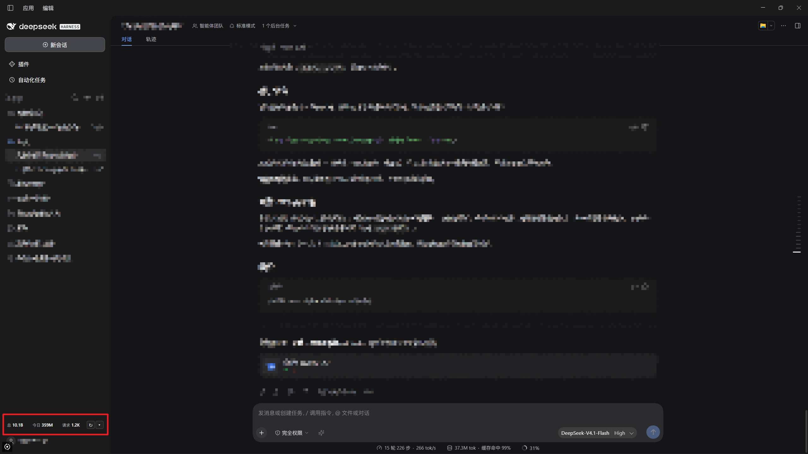
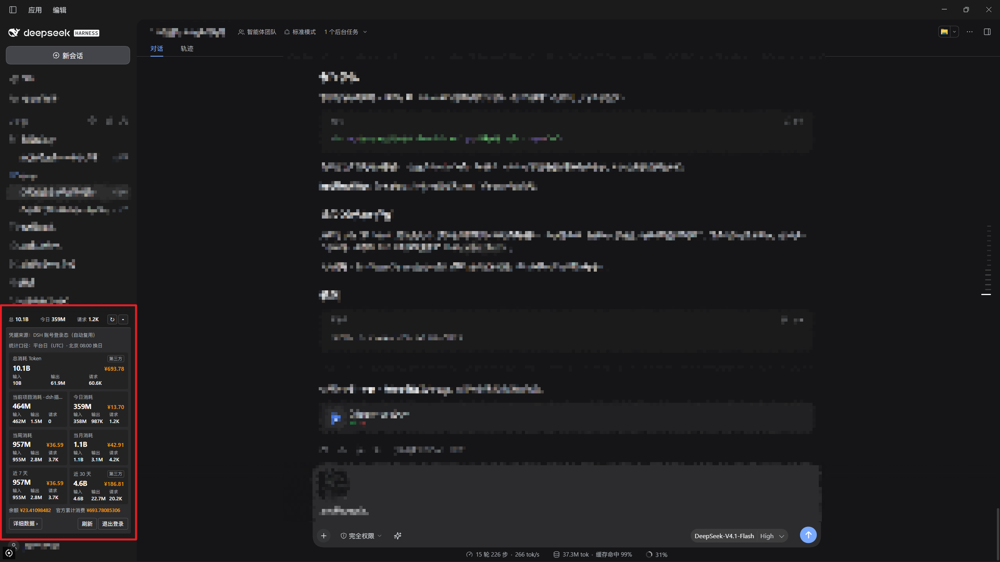
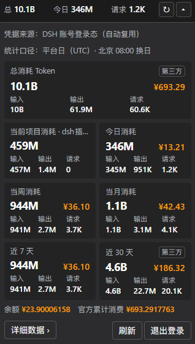
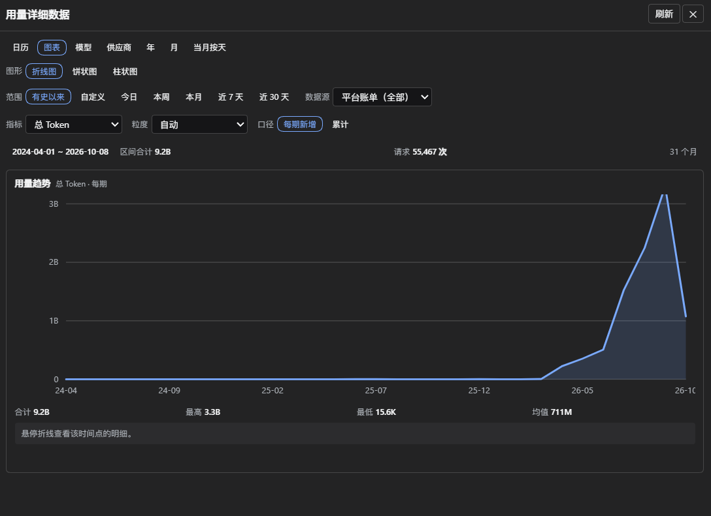
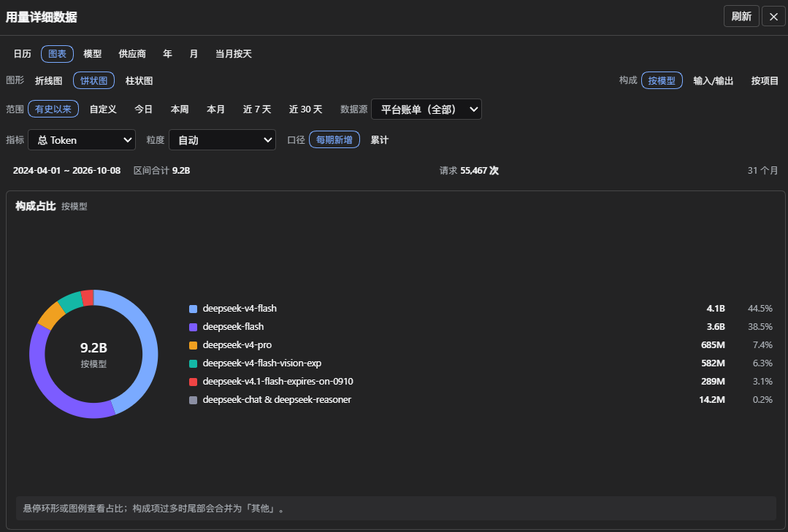
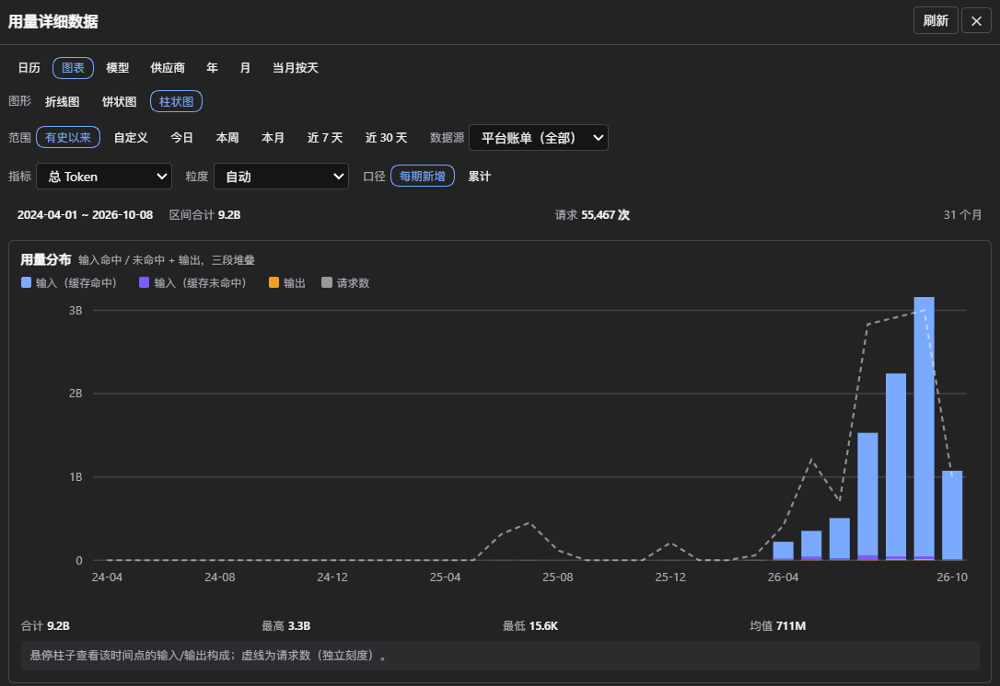
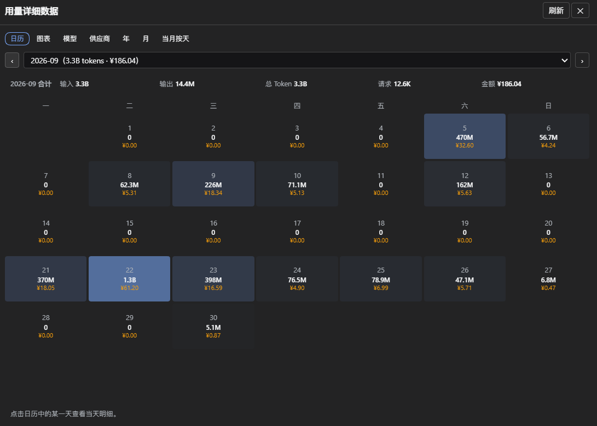

# tlogs — Token usage widget for the DSH sidebar

English | [中文](README.md)

tlogs keeps your token usage visible in the DSH desktop sidebar footer: a compact bar, an inline expand panel and a detail modal.

The compact bar lives in the footer:



Expanding it shows seven cards:



## Shapes



| Shape | Content |
| --- | --- |
| Compact bar | total, today, requests. `↻` refresh, `▾` expand |
| Expand panel | total, current project, today, this week, this month, last 7 days, last 30 days |
| Detail modal | calendar, charts, models, providers, years, months, days, settings |

## Language

Switch the plugin's UI language in the **Settings** tab of the detail modal:

| Choice | Meaning |
| --- | --- |
| Follow system (default) | DSH UI language → browser language → Chinese |
| 中文 / English | always that language |

The choice is stored in this browser and survives restarts; it only affects this plugin's UI, never DSH's own language.

## Detail data

The modal is organized by tabs. The three **charts** share one set of controls (range × source × metric × granularity) — changing any one changes all three:







The **calendar** tab lists per-day usage and cost for a month; click a day for that day's breakdown:



## Data sources

| Source | Coverage | Freshness | Cost |
| --- | --- | --- | --- |
| Platform billing | every device on the account, official channel only | 10–30 min behind | yes |
| Local session logs | this machine only, all providers | real time | no |

Merged **per day**: `max(platform, local official channel) + local third-party providers`. A single call is counted by both sources, so we take the max instead of adding them up.

- A card is marked `第三方` (third-party) only when the window contains usage the platform cannot see; other details live in the card tooltips.
- Past months and charts use platform figures. The models and providers tabs decide by **channel**, not by model name: `deepseek-v4-flash` on Volcano Ark counts as third-party.

## Install

Four ways: absolute path, tarball, npm package name, `github:<user>/dsh-tlogs`. `lib/` is prebuilt, so installing does not build.

The desktop profile cannot install from the CLI — use Settings → Plugins → Install. Other profiles: `dsh plugin --profile web add dsh-tlogs`.

Restart DSH afterwards. Tested on DSH 0.2.0-rc.2 (desktop, web).

## Credentials

| Order | Source |
| --- | --- |
| 1 | env `DEEPSEEK_PLATFORM_USER_TOKEN` |
| 2 | config `platformUserToken` (plain text) |
| 3 | DSH credential `TLOGS_USER_TOKEN` (filled in the panel) |
| 4 | reuse the signed-in DSH account |
| 5 | built-in login window (unavailable on desktop) |

The first three win over the automatic sources; signing out only clears #3.

## Configuration

Full template: [cordis.patch.yml](cordis.patch.yml).

| Option | Default | Meaning |
| --- | --- | --- |
| `exposeUsageToModel` | `false` | register the in-chat query tool |
| `useAccountSession` | `true` | reuse the DSH account credential |
| `localUsage` / `localUsageScanDays` | `true` / `32` | read session logs; days to scan |
| `enableProjectScope` | `true` | current-project card |
| `persistHistory` | `true` | persist history to disk |
| `autoRefreshSeconds` | `300` | refresh interval; 0 disables |
| `cacheTTL.total` / `.current` | `1800` / `300` | cache seconds |
| `startYear` / `startMonth` | `2024` / `4` | history start |
| `requestIntervalMs` | `1000` | delay between monthly requests |
| `numberFormat` | `short` | `full` thousands / `short` K·M·B |
| `compactMetrics` | `[total, today]` | compact-bar metrics |
| `cacheDir` | `''` | empty = `<DSH_HOME>/tlogs` |

`compactMetrics` accepts: `total`, `today`, `week`, `month`, `last7`, `last30`, `cost_total`, `cost_today`, `cost_last7`, `cost_last30`.

Environment: `DEEPSEEK_PLATFORM_USER_TOKEN`, `TLOGS_CACHE_DIR`, `DSH_HOME`.

## Security

| Measure | Detail |
| --- | --- |
| Credentials | only `getPlatformSession()` is exposed; the session credential is held during refresh only; invalid markers keep a digest |
| Network | `platform.deepseek.com` only; no redirects; header allowlist is `x-` only |
| Model isolation | no tool by default; when enabled, project ids remain irreversible hashes |
| Session logs | read-only, counts plus provider/model only; on disk, paths are hashed |
| Release gate | `npm run verify:secrets` |

Least-privilege config:

```yaml
exposeUsageToModel: false
useAccountSession: false
enableProjectScope: false
persistHistory: false
localUsage: false
```

## Caveats

**Architecture**

1. Other plugins in the same browser realm can call this plugin's RPC.
2. `.credentials.yaml` is readable by any process of the same user — the main local exposure, unrelated to this plugin.
3. The session credential can only be de-referenced, not physically erased (JS strings are immutable); whether DSH caches it internally is outside this plugin's boundary.

**Trade-offs**

4. The panel shows project labels and the local source reads session logs; both can be turned off in config.
5. Project snapshots start on the day the plugin was enabled; earlier history cannot be reconstructed.

**Habits**

6. Pasting usage figures or screenshots into a conversation puts them into the model context.

## Development

```bash
pnpm run check       # secret gate, i18n check, comment gate, typecheck, build, tests
pnpm run verify:dsh  # validate the plugin manifest with the local DSH parser
pnpm run golden      # live end-to-end comparison; needs DEEPSEEK_PLATFORM_USER_TOKEN
```

`test/golden.test.ts` skips itself when the external Python reference script is missing; point `TLOGS_REFERENCE_SCRIPT=<path>` at it.

## License

GPL-3.0-only. Full text in [LICENSE](LICENSE).
